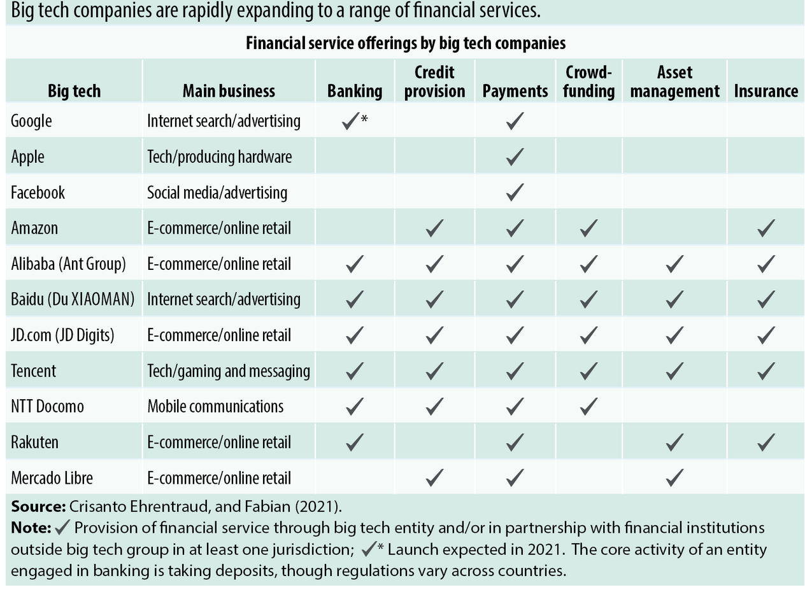
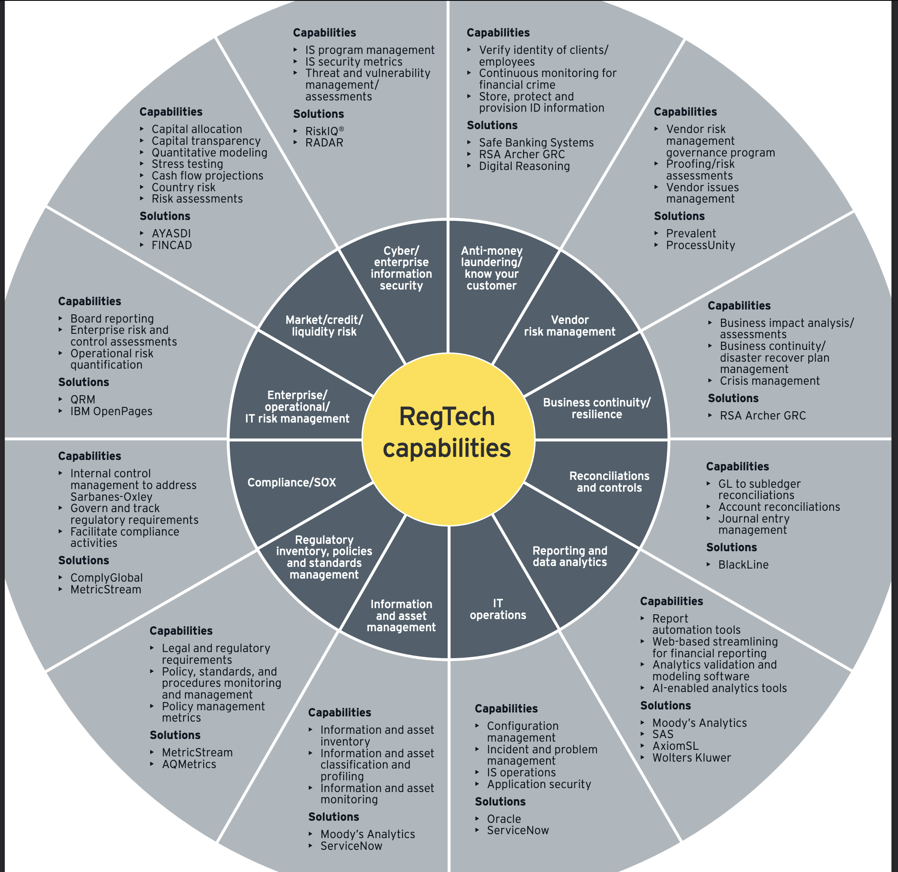
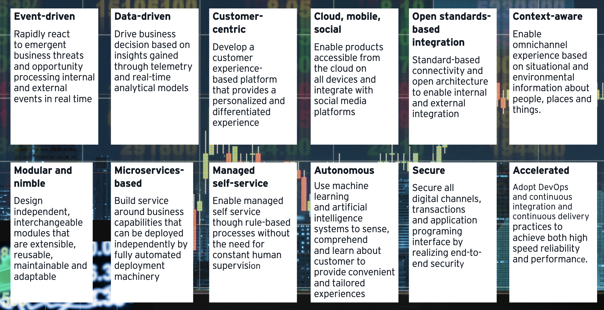

# Regulatory Technology - ComplyAdvantage

## <ins>RegTech Introduction:</ins>

1.  RegTech is the management of regulatory processes within the financial industry.
2.  The main functions of regtech include regulatory monitoring, reporting, and compliance.    
3.  It consists of a community of companies that help businesses comply with regulations efficiently and less expensively.    

>>> !!! Note: The global RegTech Market size is expected to **_grow USD 7.6 billion in 2021 to USD 19.5 billion by 2026_**, at a Compound Annual Growth Rate (CAGR) of 20.8%. 

## <ins>RegTech Origin:</ins> 

*   The rise in digital products has increased data breaches, cyber hacks, money laundering, and other fraudulent activities.     
*   Regtech reduces the risk to a company’s compliance department by offering data on money laundering activities conducted online—activities that a traditional compliance team may not be privy to due to the increase of underground marketplaces online.    
*   Regtech tools seek to monitor transactions that take place online in real-time to identify issues or irregularities in the digital payment sphere. Any outlier is relayed to the financial institution to analyze and determine if fraudulent activity is taking place. Institutions that identify potential threats to financial security early on are able to minimize the risks and costs associated with lost funds and data breaches.

## <ins>Significance of RegTech:</ins>

-   A bank that receives huge amounts of data may find it too complex, expensive, and time-consuming to comb through. A regtech firm can combine complex information from a bank with data from previous regulatory failures to predict potential risk areas that the bank should focus on. By creating the analytics tools needed for these banks to successfully comply with the regulatory body, the regtech firm saves the bank time and money. The bank also has an effective tool to comply with rules set out by financial authorities.   
-   With the use of big data and machine-learning technology, Regtech tools seek to monitor transactions that take place online in real-time to identify issues or irregularities in the digital payment sphere. Any outlier is relayed to the financial institution to analyze and determine if fraudulent activity is taking place. Institutions that identify potential threats to financial security early on are able to minimize the risks and costs associated with lost funds and data breaches.

-   **Below picture demonstrates Big Tech expansion of Financial Services.**
 

## <ins>1. Company Overview :</ins>

ComplyAdvantage, a global data technology company transforming financial crime detection. It’s powered by ComplyData,the world’s hyperscale source of financial risk insights. A new anti-money laundering (AML) program aimed at growth-focused startups called ComplyLaunch™ is launched. The program provides qualified startups with free access to the company’s award-winning AML and Know Your Customer (KYC) tools and resources needed to uncover and reduce the threat of money-laundering activities so they can onboard new customers with lower risk and greater trust.    

|   Company |   Details|
| :-------------- | :------------------ |
| Name | ComplyAdvantage |
| Incorporated | Londan, United Kingdom in 2014 | 
| Founders | Charles Delingpole, CEO |
| Awards | Best RegTech Solution award at Finovate | 
| Global Hubs | New York, London, Singapore and Cluj-Napoca |
| Funding | Ontario Teachers’, Index Ventures and Balderton Capital |
| Employees | ~500 in 75 countries |

### <ins>2. Birth of the company and Funding:</ins>

* ComplyAdvantage was born out of frustration experienced first-hand by the founder, Charles Delingpole. Despite trying tool after tool to manage his responsibilities as an MLRO, they all had the same issues: being difficult to integrate, hard-to-use, and poor at providing relevant alerts.
* ComplyAdvantage has raised a **_total of $108.2M in funding over 4 rounds from venture capital funding_**. Their latest funding was raised on May 20, 2021 from a Series C round.

### <ins>3. Business Activities:</ins>

1. ComplyAdvantage helps firms make intelligent choices when complying with regulations relating to sanctions, money laundering (AML), terrorist financing (CFT), bribery, and corruption. Its database of individuals, organizations, and associated entities provides real-time insight into financial crime risks. ComplyAdvantage uses artificial intelligence, machine learning, and big data analytics combined with a tailored risk-based approach to help firms not only to manage their compliance and risk obligations, but also to prevent the occurrence of financial crime.
2. ComplyAdvantage’s mission is to neutralize the risk of money laundering, terrorist financing, corruption, and other financial crime.
More than **_700 enterprises in 69 countries rely on ComplyAdvantage to understand the risk_** of who they’re doing business with through the world's only global, real-time database of people and companies.
3. The company actively identifies tens of thousands of risk events from millions of structured and unstructured data points every single day. 
ComplyAdvantage has **four global hubs located in New York, London, Singapore and Cluj-Napoca** and is backed by Ontario Teachers’, Index Ventures and Balderton Capital.

### <ins>4. Landscape:</ins>

- ComplyAdvantage is the financial industry’s leading source of AI-driven financial crime risk data and detection technology. 
It offers a true hyperscale financial risk insight and AML data solution that leverages machine learning and natural language processing to help regulated organizations manage their risk obligations and prevent financial crime.

- To expand further, the company offers AML onboarding and monitoring, AML transaction monitoring, payment screening, and politically exposed persons (PEPs) and adverse media screening. 
- ComplyAdvantage also offers real-time sanctions and watch list screening using global lists maintained by the Office of Foreign Assets Control (OFAC), European Union (EU), United Nations (UN), Department of Foreign Affairs and Trade (DFAT), and other governmental, law enforcement, and regulatory databases.

### <ins>5. The other major companies:</ins>

| Companies | Investment Steps| Total Funding|
| :-------------- | :------------------: | ------------------: |
| Chainalysis | Series E | $366.72M |
| Sift | Series E | $156.52M |
| Forter | Series F | $525M |
| Signifyd | Series E | $411.2M |
| Hummingbird | Series B | $41.2M |
| Unit21 | Series B | $47M |
| Feedzai | Series D | $277.8M |

### <ins>6. Business Success and Core metrics:</ins>

* ComplyAdvantage has been selected for the Chartis Research RiskTech100®, an annual evaluation of the leading global risk technology providers for the second year in a row.    
* RiskTech100® is acknowledged as the most comprehensive independent study of the world’s major players in risk and compliance technology. Using a robust, repeatable methodology, it ranks the top 100 risk technology providers and identifies the top players in specific risk and compliance categories.     
* The company’s proprietary ComplyData™ graph is derived from millions of data points that provide dynamic, real-time insights across sanctions, watchlists, politically exposed persons, and negative news. This reduces dependence on **manual review processes and legacy databases by up to 80% and improves how companies screen and monitor clients and transactions.**

&nbsp;&nbsp;&nbsp;&nbsp;&nbsp;&nbsp;**Recent success**
* ComplyAdvantage Releases State Of Financial Crime Report Highlighting Emerging Threats for 2022.
    > Key hightlights :-  
    >> SAR filing rises  
    >> Cybercrime concern grows  
    >> Geopolitical hotspots heat up  
    >> Crypto becomes the norm  
* Novo,  an award-winning digital banking platform , has selected the ComplyAdvantage Transaction Monitoring solution to provide an innovative, API-driven solution with competitive economics.

### <ins>7. RegTech Solution and Recommendations:</ins>  
   
- [X] **The next generation of RegTech solutions need to address the complex needs of compliance capability using digital solutions to focus on the end user; communicate efficiently, nimbly and flexibly; and act, think and importantly behave like humans.**  
**Below diagram describes the capabilities and products of RegTech yet to be addressed.**
 

 
 

- [X] **I would like to recommend the RegTech company to expand their solution and offer products and services using below technologies which would holistic and make it safe for human existance using the skyrocketing technicial expansion.**
 

 
 

- [X] **Technologies appropriate for my solution would be AWS Cloud services, AI, Deep learning, Block chain, IOT, Robertics, Predictive Analystics, NoSQL, Ansible, Docker and Machine learning.**
 
 
 

### <ins>Research Materials:</ins>

|   Research |   References|
| :-------------- | :------------------ |
| [ComplyAdvantage](https://complyadvantage.com/) | Company Website |
| [BusinessWire](https://www.businesswire.com/news/home/20210426005376/en/ComplyAdvantage-Announces-ComplyLaunch%E2%84%A2) | Product launch ComplyLaunch™ |
| [Reuters](https://www.reuters.com/business/finance/london-fintech-funding-soars-first-half-year-2021-07-07/) | British capital's resilience as a hub for digital financial services post-Brexit|
| [TechCrunch](https://techcrunch.com/2020/07/28/complyadvantage-nabs-50m-for-an-ai-platform-and-database-to-detect-and-stop-financial-crime/) | $50M for an AI platform and database to detect and stop financial crime |
| [GlobeNewsWire](https://www.globenewswire.com/news-release/2021/11/23/2339612/0/en/ComplyAdvantage-Honored-To-Make-Chartis-Research-RiskTech100-List-For-A-Second-Straight-Year.html) | ComplyAdvantage Honored To Make Chartis Research RiskTech100 List |
| [RegTech Whitepaper](https://assets.ey.com/content/dam/ey-sites/ey-com/en_us/topics/financial-services/ey-regulatory-technology-regtech.pdf) | RegTech Future |
| [IMF](https://www.imf.org/external/pubs/ft/fandd/2021/05/big-tech-fintech-and-financial-regulation-crisanto-ehrentraud.htm) | International Monetary Fund |
| [ComplyAdvantage Wiki](https://en.wikipedia.org/wiki/ComplyAdvantage) | Wiki |
